# EdgeGuard - Toàn bộ luồng hệ thống

Tài liệu này mô tả trạng thái **thực tế theo code hiện tại** của ba thành phần:

- `hardware/EdgeGuardDevice`: firmware ESP32 chính.
- `mini-app/backend`: Express backend, MQTT client, camera proxy và xử lý AI/RFID.
- `mini-app/src`: Telegram Mini App và Next.js API.

Ngoài luồng chính, tài liệu cũng ghi riêng `hardware/CameraCapture` và AI worker MQTT cũ để tránh nhầm chung với kiến trúc đang chạy.

## Ký hiệu

| Ký hiệu | Ý nghĩa |
|---|---|
| `[NEW]` | Use case hoặc branch mới trong working tree hiện tại so với `HEAD` |
| `[LEGACY]` | Vẫn còn code hỗ trợ nhưng không phải đường chính |
| `[GAP]` | Có cấu hình/code một phía nhưng luồng end-to-end chưa hoàn chỉnh |
| Retained | MQTT broker giữ message cuối để client reconnect nhận lại |

## 1. Sơ đồ tổng quan

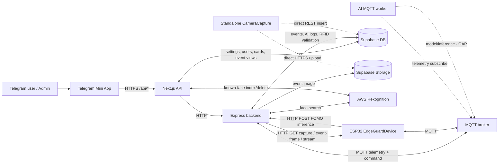

Đường chính device-server là kết hợp của hai transport:

| Chiều | Transport | Dữ liệu |
|---|---|---|
| Device -> Server | MQTT | status, telemetry, RFID, camera endpoint, vision alert |
| Device -> Server | HTTP | FOMO inference JSON |
| Server -> Device | MQTT | config, servo, alarm, buzzer, reboot, vision result |
| Server -> Device | HTTP GET | live stream, capture hiện tại, exact event frame |

## 2. Danh sách use case

| ID | Use case | Actor chính | Trạng thái |
|---|---|---|---|
| UC-01 | Khởi động, kết nối Wi-Fi/MQTT, reconnect | Device, backend | Đang dùng |
| UC-02 | Discovery camera và đồng bộ config retained | Device, backend, Supabase | Đang dùng; có `[NEW]` |
| UC-03 | Telemetry, status và tạo event cảm biến | Device, backend | Đang dùng |
| UC-04 | Xem camera live và fallback frame | User, app, backend, device | Đang dùng; có `[NEW]` |
| UC-05 | Mở/khóa cửa từ xa và auto-lock | User, app, device | Đang dùng |
| UC-06 | Bật/tắt alarm, buzzer, reboot, command dev | User/dev, backend, device | Đang dùng |
| UC-07 | Quét RFID online/offline | Device, backend, Supabase | Đang dùng |
| UC-08 | Thêm/sửa/xóa/duyệt thẻ RFID | Admin, app, backend, device | Đang dùng |
| UC-09 | FOMO, exact frame và Rekognition | Device, backend, AWS | Đang dùng; có `[NEW]` |
| UC-10 | Stranger/object-left/camera-blocked alert | Device, backend | Đang dùng; có `[NEW]` |
| UC-11 | Quản lý khuôn mặt quen | Admin, app, Storage, AWS | Đang dùng |
| UC-12 | Dashboard, lịch sử, đánh dấu đã xem | User, app, backend | Đang dùng |
| UC-13 | Phân quyền và quản lý Telegram user | Admin, app, Supabase | Đang dùng, có lưu ý |
| UC-14 | CameraCapture độc lập | Người dùng, camera, Supabase | Luồng riêng |
| UC-15 | Ảnh MQTT và AI MQTT worker | Device/worker, broker | `[LEGACY]` / `[GAP]` |
| UC-16 | API vận hành, test ảnh và manual event | Operator/dev, backend | Hỗ trợ dev; có `[GAP]` |

## 3. UC-01 - Khởi động và kết nối device-server

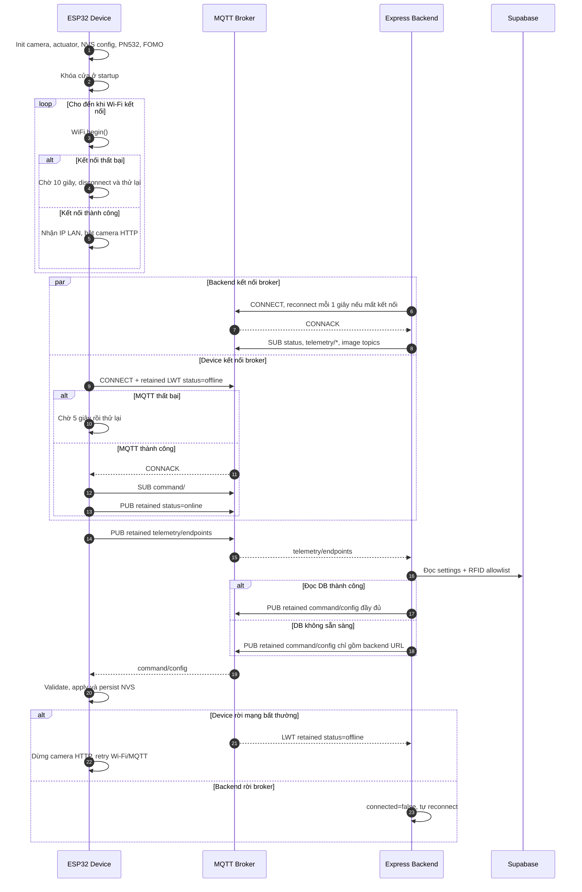

Branch chi tiết:

| Điều kiện | Xử lý |
|---|---|
| Camera init lỗi | Firmware retry theo `CAMERA_INIT_RETRY_MS` |
| Camera capture lỗi liên tiếp | Deinit, khởi động lại camera |
| MQTT JSON/packet quá lớn | Không publish, ghi log lỗi |
| Config có URL FOMO không hợp lệ | Device bỏ qua URL đó |
| Mở NVS thất bại | Config vẫn áp dụng trong RAM, không persist được |
| Mất Wi-Fi | Camera server dừng; endpoint sẽ publish lại sau reconnect |

## 4. UC-02 - Discovery camera và đồng bộ config

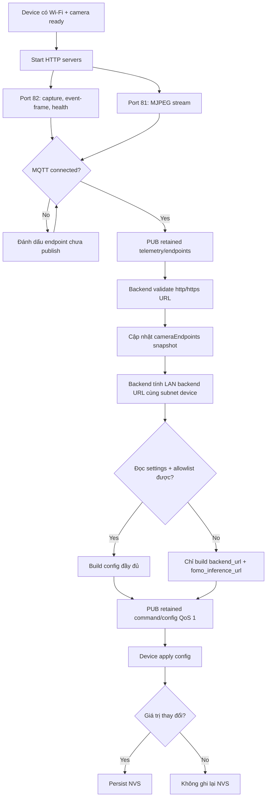

Config đầy đủ hiện đồng bộ xuống device:

| Field | Tác dụng trên device |
|---|---|
| `auto_lock_enabled`, `auto_lock_ms` | Lập lịch khóa lại sau khi mở |
| `camera_publish_enabled` | Cho phép camera HTTP live |
| `ai_detection_enabled` | Bật/tắt FOMO inference |
| `camera_blocked_alert_enabled` | Bật/tắt publish alert camera bị che |
| `backend_url`, `fomo_inference_url` | Địa chỉ HTTP device gửi inference |
| `lock_angle`, `unlock_angle` | Góc servo |
| `rfid_allowlist` | Cache tối đa 32 thẻ để mở offline |

`[NEW]` Port camera được tách: control ở `82`, MJPEG stream ở `81`. Mỗi khi backend nhận endpoint mới, backend đồng bộ lại FOMO URL để chọn IP LAN phù hợp subnet của device.

## 5. UC-03 - Telemetry và event cảm biến

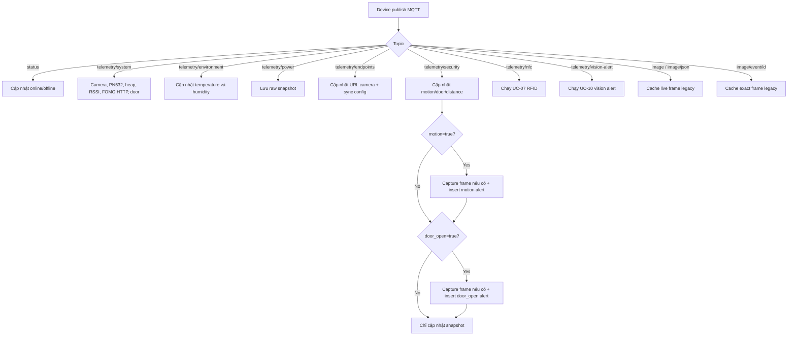

Backend expose snapshot qua `GET /api/mqtt/status`; Next.js `GET /api/status` ghép snapshot này với `device_settings` để trả về dashboard.

`[GAP]` Backend có subscribe `telemetry/environment` và `telemetry/power`, nhưng firmware `EdgeGuardDevice` hiện không publish hai topic này. `power` cũng chưa có logic summarize riêng ngoài raw topic snapshot.

## 6. UC-04 - Xem camera live

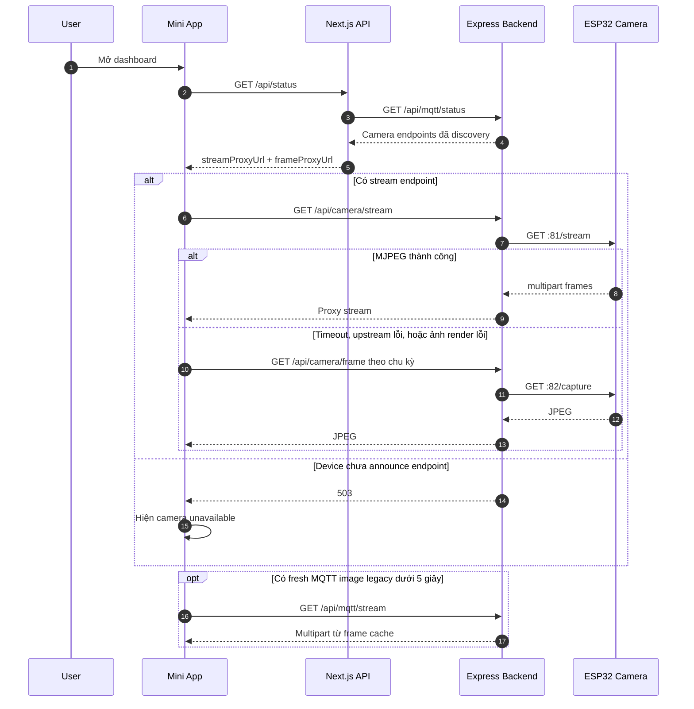

Nhánh proxy frame trả về `502` nếu upstream không phải image/ảnh rỗng, `504` nếu timeout, và `503` nếu chưa có endpoint.

## 7. UC-05 - Mở/khóa cửa từ xa

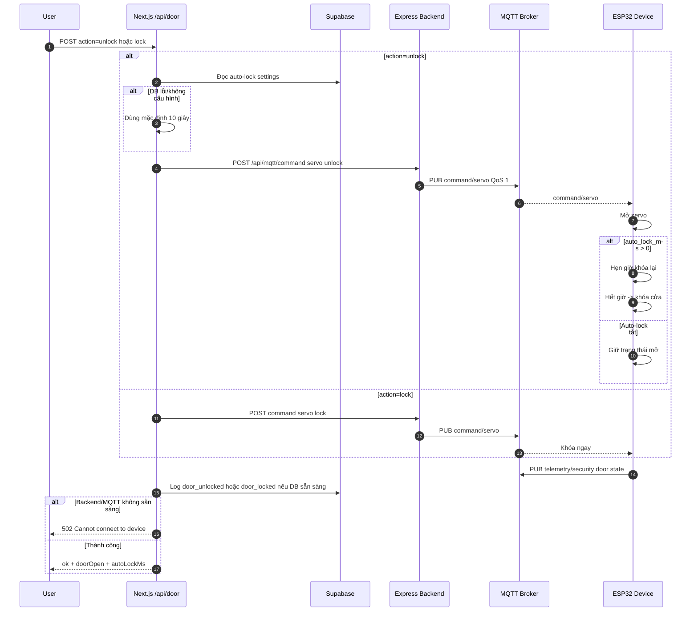

Lưu ý: API trả thành công khi MQTT broker đã nhận publish; hiện không có command ACK riêng từ device. Telemetry door state là xác nhận gián tiếp.

## 8. UC-06 - Alarm, buzzer, reboot và command

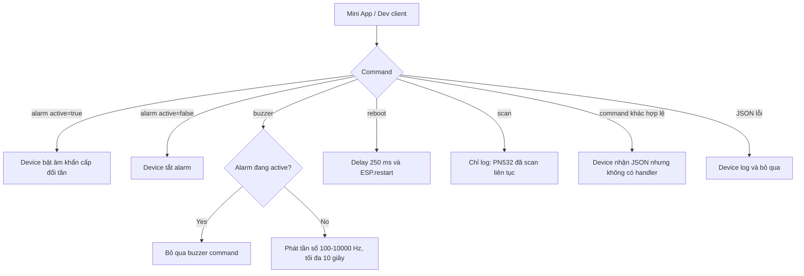

Alarm từ Mini App được log vào Supabase nếu DB sẵn sàng. Endpoint dev `POST /api/mqtt/command` chấp nhận tên command theo `[a-z0-9_-]+`; `POST /api/mqtt/send` có thể publish topic tùy ý.

## 9. UC-07 - Quét RFID online và offline

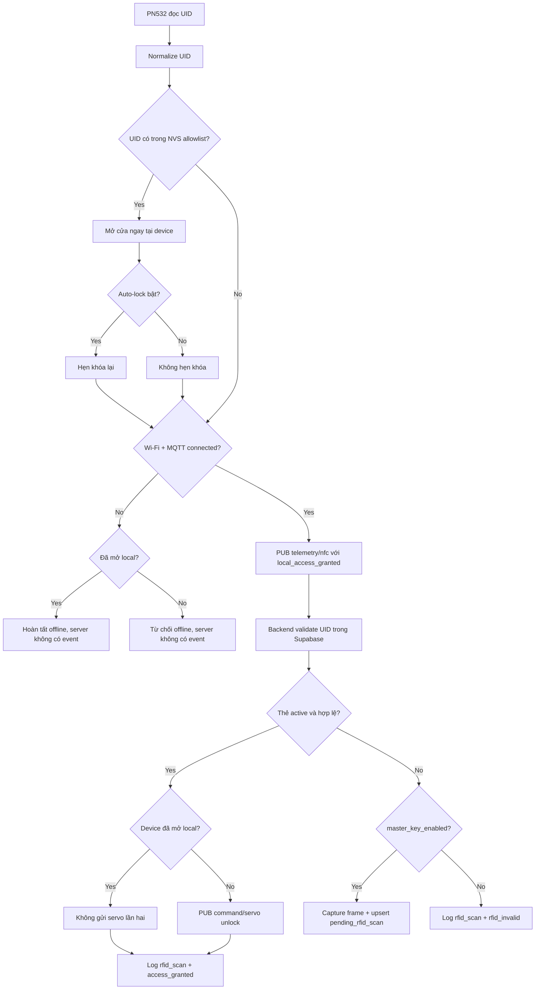

Nếu `RFID_ALLOW_ALL=true`, backend coi mọi thẻ là hợp lệ trong chế độ test. Firmware vẫn chỉ mở local khi UID nằm trong allowlist; nếu chưa có, backend sẽ gửi servo command sau khi nhận scan.

## 10. UC-08 - Quản lý và duyệt thẻ RFID

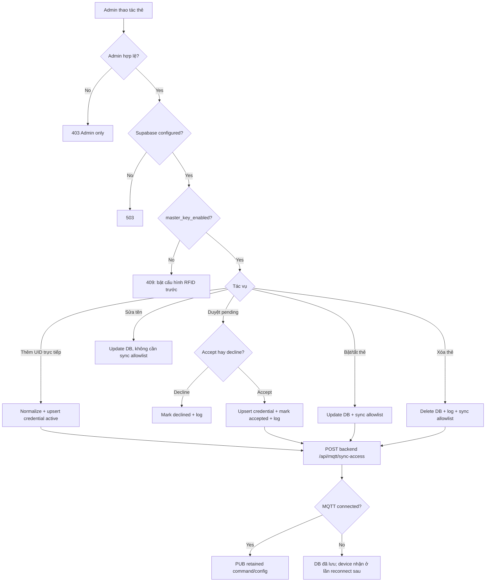

Mỗi lần sync, allowlist được deduplicate, normalize và cắt tối đa 32 UID trước khi gửi xuống device.

## 11. UC-09 - FOMO, exact event frame và Rekognition

```mermaid
sequenceDiagram
    autonumber
    participant D as ESP32 FOMO
    participant B as Express Backend
    participant DB as Supabase
    participant AWS as Rekognition
    participant M as MQTT Broker

    D->>D: Camera baseline + scene-change analysis
    alt AI detection tắt
        D->>D: Không chạy FOMO, vẫn chạy camera-tamper
    else Chưa đủ 1.5 giây cooldown hoặc thay đổi dưới threshold
        D->>D: Không inference; tiếp tục stability timer nếu có
    else Đủ điều kiện
        D->>D: Cache JPEG với event_id, chạy FOMO
    end

    alt Không có detection
        D->>D: Không queue HTTP result
    else Có detection
        D->>D: Queue inference JSON
        loop Cho đến khi POST thành công
            alt Wi-Fi mất hoặc HTTP lỗi
                D->>D: Chờ retry; nếu có event mới thì thay event cũ
            else Gửi được
                D->>B: POST /api/fomo/inference + device id
                B-->>D: 202 Accepted
            end
        end
    end

    alt Device id/body/event/label/confidence không hợp lệ
        B-->>D: 401 hoặc 422
    else confidence <= 0.7
        B->>B: Cập nhật snapshot, không log AI/recognition
    else confidence > 0.7
        B->>D: GET :82/event-frame?event_id=N
        alt Header event id khớp và có image
            D-->>B: Exact JPEG + X-EdgeGuard-Event-Id
        else HTTP exact frame lỗi
            B->>B: Thử exact MQTT event cache legacy
            alt Không có exact cache
                B->>B: Tiếp tục không ảnh, không thay bằng live frame mới
            end
        end
        B->>DB: Insert AI log một lần cho event
    end

    alt Detection không phải person
        B->>B: Không gọi Rekognition
    else Person + có exact image
        B->>AWS: Detect/search faces, threshold 75
        AWS-->>B: Matched/unmatched faces
        B->>DB: Lookup face id -> display name
        B->>M: PUB command/vision-result kèm event_id
        M-->>D: Recognition result
        alt Tất cả người đều quen
            B->>DB: Insert face_recognized info event
            D->>D: Track known person, không stranger alert
        else Có ít nhất một stranger
            D->>D: Bắt đầu stranger stability timer
        end
    else Person nhưng thiếu ảnh hoặc Rekognition lỗi
        B->>M: vision-result verified=false + reason
        D->>D: Giữ trạng thái waiting cho đến lần reclassify sau
    end
```

`[NEW]` HTTP delivery chạy task riêng, retry khi offline/lỗi và ưu tiên inference mới nhất. Backend tuyệt đối không dùng live frame mới thay cho exact event frame sai/mất `event_id`.

## 12. UC-10 - Các branch vision alert

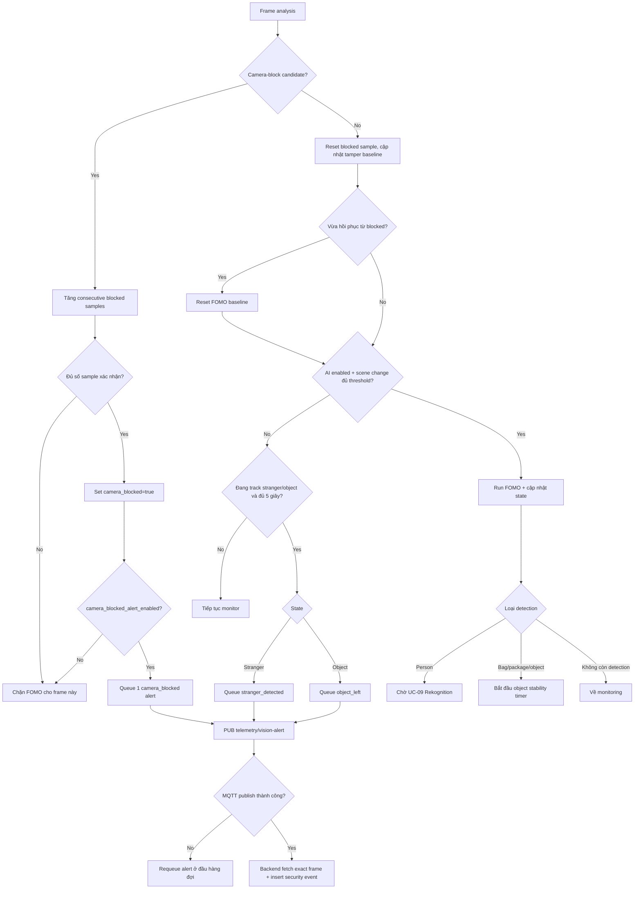

Camera-block có độ ưu tiên cao hơn FOMO và vẫn được phân tích khi AI bị tắt. Một blocked episode chỉ publish một alert; khi camera hồi phục thì reset baseline và cho phép alert mới ở episode sau.

## 13. UC-11 - Quản lý khuôn mặt quen

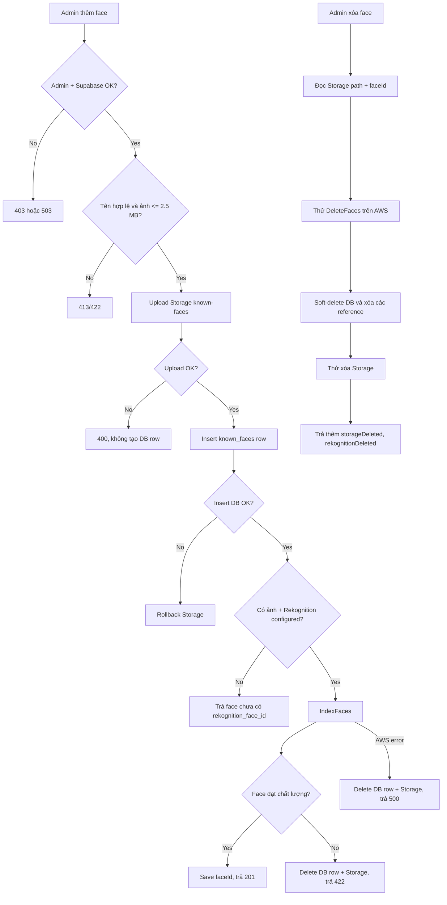

Nhánh xóa là best-effort với AWS/Storage: DB vẫn có thể soft-delete thành công dù một dịch vụ ngoài thất bại.

## 14. UC-12 - Dashboard và lịch sử sự kiện

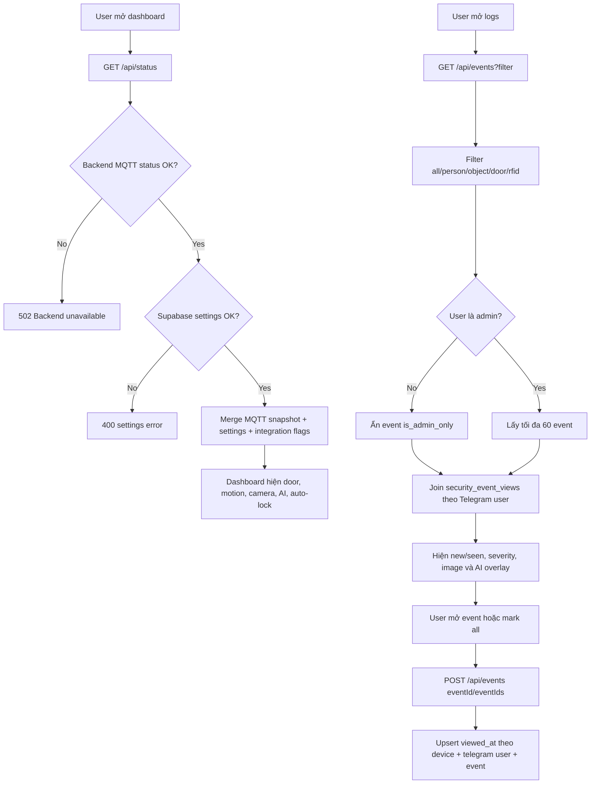

AI overlay trên dashboard chỉ hiện inference mới trong 6 giây; live MQTT frame chỉ được coi là mới trong 5 giây.

## 15. UC-13 - Phân quyền và Telegram user

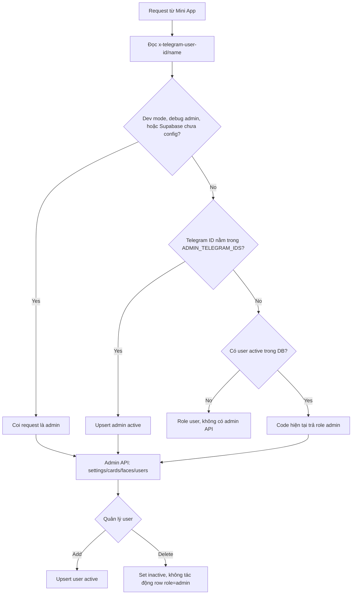

`[GAP]` `server-auth.ts` hiện trả `role: admin` cho mọi user active dù field `role` trong DB. Nếu mục tiêu là có role `user` chỉ xem dashboard/log, branch này cần được sửa trước production.

## 16. UC-14 - Standalone CameraCapture

Luồng này độc lập, không qua MQTT, Express hay Next.js:

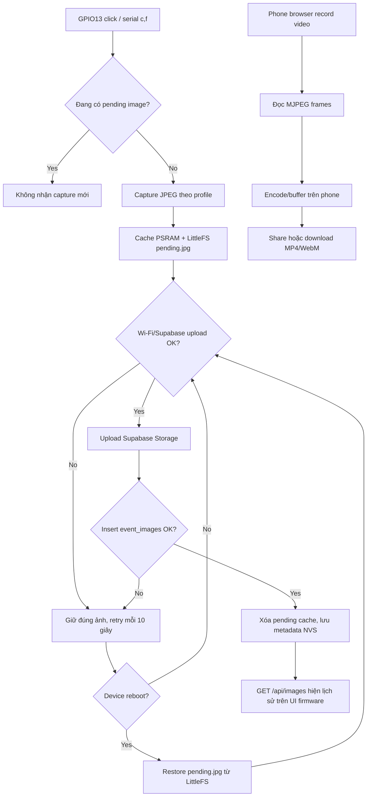

Video không được device encode, không upload Supabase và không đi qua server EdgeGuard.

## 17. UC-15 - Luồng legacy và luồng chưa nối đầy đủ

### 17.1 Ảnh qua MQTT `[LEGACY]`

Backend vẫn subscribe:

```text
{base}/image
{base}/image/json
{base}/image/event/+
```

Ảnh retained bị backend xóa ngay để tránh dùng frame cũ. Main firmware hiện dùng HTTP cho live/exact frame và không còn publish exact event JPEG qua MQTT.

### 17.2 AI MQTT worker `[GAP]`

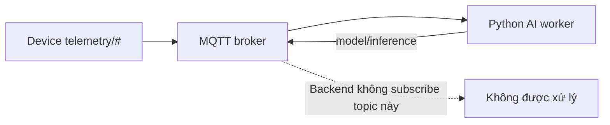

Worker `ai-models/src/edgeguard_models/mqtt_inference.py` vẫn publish `{base}/model/inference`, nhưng `mini-app/backend/services/mqtt-service.js` không đưa topic này vào subscriptions. FOMO HTTP là AI path đang hoạt động.

### 17.3 Settings chưa được enforce end-to-end `[GAP]`

| Setting | Được lưu DB | Được đồng bộ/enforce |
|---|---|---|
| Auto-lock | Có | Có, device |
| Camera live publishing | Có | Có, device |
| AI detection | Có | Có, device |
| Camera blocked alert | Có | Có, device |
| RFID configuration/master mode | Có | Có, backend card flow |
| Object-left enabled/max seconds | Có | Chưa; firmware đang dùng timer cố định 5 giây |
| Stranger alert enabled | Có | Chưa; backend/device chưa gate alert theo setting |
| Telegram alert enabled | Có | Chưa; Telegram service chưa được gọi trong event flow |

Telegram service hiện tại chỉ là placeholder tạo link giả lập và không được khởi tạo/gọi bởi event pipeline.

## 18. UC-16 - API vận hành, test và manual event

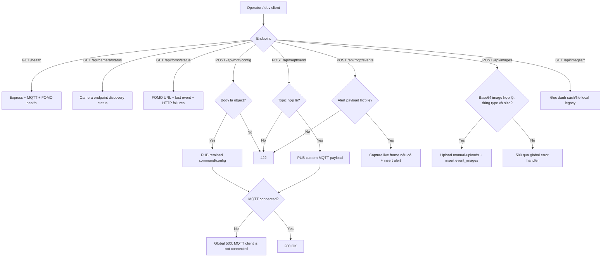

`[GAP]` `GET /api/images` đọc thư mục local `data/images`, trong khi luồng upload hiện tại đưa ảnh vào Supabase Storage và không ghi file local. Vì vậy danh sách local có thể rỗng trừ khi có artifact cũ bên ngoài.

## 19. MQTT topic contract

| Topic | Chiều | Retain | Xử lý |
|---|---|---|---|
| `{base}/status` | Device -> Server | Có | `online`; LWT `offline` |
| `{base}/telemetry/system` | Device -> Server | Không | Health và FOMO HTTP metrics |
| `{base}/telemetry/environment` | Producer -> Server | Không | Temperature/humidity; main firmware chưa publish |
| `{base}/telemetry/power` | Producer -> Server | Không | Raw snapshot; main firmware chưa publish |
| `{base}/telemetry/security` | Device -> Server | Không | Door/motion + tạo event |
| `{base}/telemetry/nfc` | Device -> Server | Không | RFID validation |
| `{base}/telemetry/endpoints` | Device -> Server | Có | Camera discovery + config resync |
| `{base}/telemetry/vision-alert` | Device -> Server | Không | Stranger/object/camera-blocked |
| `{base}/command/config` | Server -> Device | Có | Config + allowlist + backend URL |
| `{base}/command/servo` | Server -> Device | Không | Lock/unlock |
| `{base}/command/alarm` | Server -> Device | Không | Urgent buzzer |
| `{base}/command/buzzer` | Server -> Device | Không | Tone có thời hạn |
| `{base}/command/vision-result` | Server -> Device | Không | Recognition result theo event id |
| `{base}/command/reboot` | Server -> Device | Không | Restart device |
| `{base}/image*` | Device -> Server | Không | Ảnh legacy |

## 20. HTTP contract chính

| Endpoint | Caller -> Callee | Mục đích |
|---|---|---|
| `POST /api/fomo/inference` | Device -> Express | Gửi FOMO inference |
| `GET /api/fomo/status` | Operator -> Express | Chẩn đoán FOMO HTTP `[NEW]` |
| `GET :82/event-frame?event_id=` | Express -> Device | Lấy exact frame |
| `GET :82/capture` | Express -> Device | Lấy live JPEG |
| `GET :81/stream` | Express -> Device | Lấy MJPEG |
| `POST /api/mqtt/command` | Next.js/dev -> Express | Gửi command MQTT |
| `POST /api/mqtt/sync-access` | Next.js -> Express | Đồng bộ retained config |
| `GET /api/mqtt/status` | Next.js -> Express | Snapshot hệ thống |
| `GET /api/camera/stream` | App -> Express | Proxy MJPEG |
| `GET /api/camera/frame` | App -> Express | Proxy JPEG fallback |
| `GET,POST /api/settings` | App -> Next.js | Đọc/lưu settings và trigger config sync |
| `GET,POST,PUT,DELETE /api/cards` | App -> Next.js | RFID CRUD và pending approval |
| `GET,POST,DELETE /api/faces` | App -> Next.js | Known-face CRUD + Storage/Rekognition |
| `GET,POST,DELETE /api/users` | App -> Next.js | Telegram user management |
| `GET,POST /api/events` | App -> Next.js | Đọc/filter event và mark viewed |
| `POST /api/door` | App -> Next.js | Lock/unlock |
| `POST /api/alarm` | App -> Next.js | Bật/tắt alarm |
| `GET /api/me` | App -> Next.js | Role hiện tại |
| `POST /api/images` | Dev -> Express | Manual base64 image upload |
| `POST /api/mqtt/events` | Dev -> Express | Tạo manual security event |

## 21. Note các use case/branch mới

1. `[NEW]` Camera HTTP tách thành control port `82` và MJPEG port `81`.
2. `[NEW]` Endpoint announcement có `event_frame_url`, `stream_port`, `live_mode=mjpeg`.
3. `[NEW]` Backend chọn FOMO HTTP URL theo LAN/subnet của device và resync khi nhận endpoint.
4. `[NEW]` FOMO HTTP delivery có task riêng, retry và thay pending event cũ bằng event mới hơn.
5. `[NEW]` `GET /api/fomo/status` trả URL, event cuối và thống kê lỗi HTTP từ device.
6. `[NEW]` Exact event frame không fallback sang live frame mới; sai/mất `X-EdgeGuard-Event-Id` thì event được lưu không ảnh.
7. `[NEW]` Camera-tamper chạy độc lập với FOMO AI; `camera_blocked_alert_enabled` chỉ gate việc publish alert.
8. `[NEW]` MQTT vision alert được rút gọn; nếu publish lỗi thì requeue thay vì bỏ mất.

## 22. Nguồn code đối chiếu

| Phạm vi | File chính |
|---|---|
| Device lifecycle/MQTT/config | `hardware/EdgeGuardDevice/EdgeGuardDevice.ino`, `mqtt.h`, `device.h` |
| RFID/door/alarm | `pn532_reader.h`, `actuators.h`, `sensors.h` |
| Camera/FOMO | `camera.h`, `fomo.h` |
| Backend orchestration | `mini-app/backend/services/mqtt-service.js` |
| Backend routes | `mini-app/backend/routes/mqtt.js`, `camera.js`, `fomo.js` |
| Mini App API | `mini-app/src/app/api/*` |
| DB/Storage | `schema.sql`, `mini-app/backend/services/supabase-service.js` |
| Standalone camera | `hardware/CameraCapture/README.md`, `CameraCapture.ino` |
| Legacy AI worker | `ai-models/src/edgeguard_models/mqtt_inference.py` |
